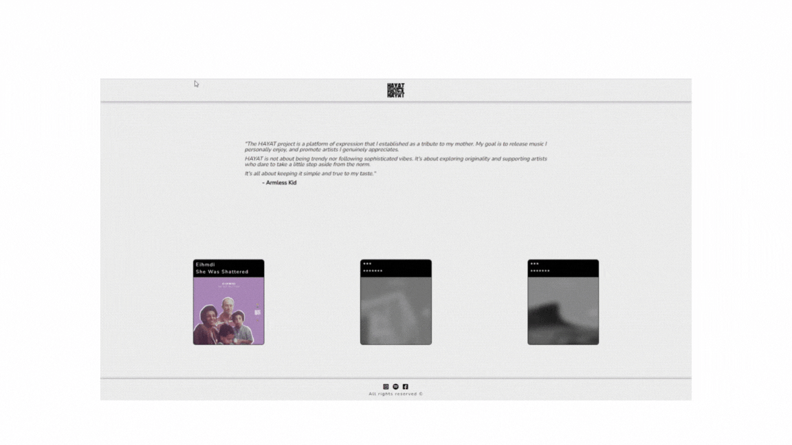

# HAYAT website
[Link to hosted website](https://hayatmusic.com)

I'm running an electronic music label and wanted to have my own website to showcase the music and everything related to it such as: the bio, mixes, spotify previews etc..

This is developped with React and a few libraries such as React Router Dom, SASS at the moment but i'm willing to use Redux in the future to handle API calls properly.

